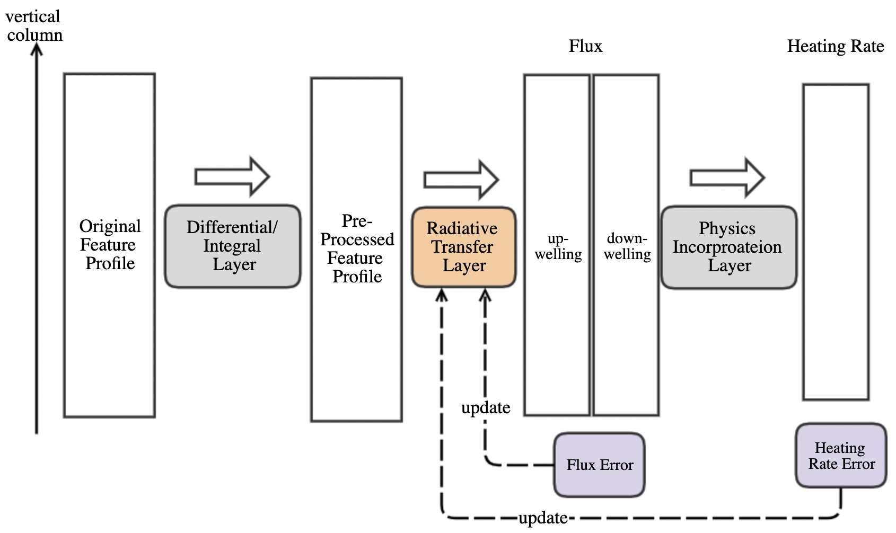

## Overall Architecture
This repo is the implementation  of the article "Physics-Incorporated Framework for Emulating Atmospheric Radiative Transfer and the Related Network Study".
We propose a physics-incorporated framework for the radiative transfer DL model, in which the physical relationship between fluxes and heating rates is encoded as a layer of the network. It is also found that the prediction accuracy was improved with the physic-incorporated layer. In addition, we trained and compared various types of deep learning model architectures, including fully connected (FC) neural networks (NNs), convolutional-based NNs (CNNs), bidirectional recurrent-based NNs (RNNs), transformer-based NNs, and neural operator networks, respectively.


<p align="center">

</p>


## Code Structure
The code description is as follows: 
- main program: main.py
- ./models/  network structure folder
- ./utils/   utils folder
- ./checkpoints/  saved checkpoints 


##  How to train the model 
The following is an example script of running the LSTM model. 
```
./scripts/run_script.sh
```
The specific script file is as follows. The model structure can be selected by the argument "model_name", and the avialable model structures are "FC","RES","UNET","LSTM","GRU","FNO","ATT" etc, and the detailed description of each model can be found in our paper. 

```
python main_fullyear.py \
--main_folder "FullYear" \
--sub_folder "FullYear_V01" \
--train_file "./dataset/fullyear_trainset_240_10_useful.nc" \
--train_point_number 15943 \
--test_file "./dataset/fullyear_trainset_240_10_useful.nc" \
--test_point_number 15943 \
--prefix "fullyear_V01" \
--dataset_type "FullYear" \
--loss_type "v01" \
--learning_rate  1e-3  \
--batch_size 10 \
--model_name "LSTM" \
--num_workers 0 \
--num_epochs 600 \
--save_mode "True" \
--save_checkpoint_name "model" \
--save_per_samples 10000 \
--load_model "False" 

```

The figures shown in the paper can be generated using the code in the paper_plot folder. 
The vertical profiles of the statistics can be generated by plot_height_distribution.py. 
The vertical profiles of the liquid water distribution of the 3 typical case:no
liquid cloud, single-layer liquid cloud , and multi-layer liquid cloud can be generated by plot_instaneous.py


### License

This project is under the CC-BY-NC 4.0 license. See [LICENSE](LICENSE) for details.